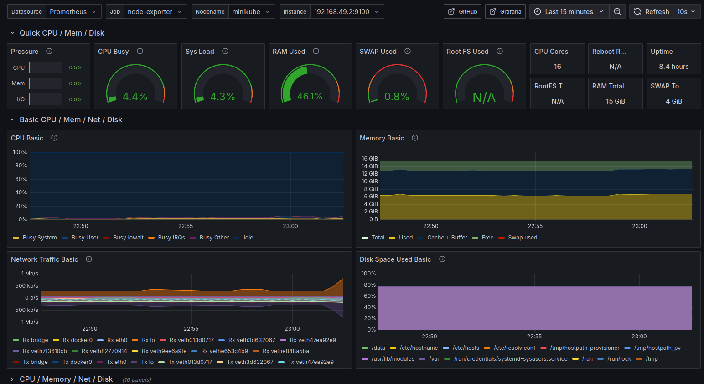
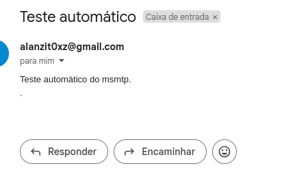

## Mini-NOC com Kubernetes

Este projeto configura uma stack de monitoramento com Prometheus, Grafana e Alertmanager em um cluster Kubernetes local (Minikube). A coleta de métricas é feita através do kube-state-metrics e Node Exporter, com visualizações via Grafana.

### Arquitetura do Sistema

O diagrama abaixo representa como o sistema é organizado:


### Tecnologias Utilizadas

- Kubernetes
- Prometheus
- Grafana
- Alertmanager
- kube-state-metrics
- Node Exporter

### Objetivo

Criar uma estrutura funcional de NOC para fins de aprendizado com foco em infraestrutura baseada em Kubernetes.

### Dashboards Grafana

Foram importados dashboards públicos para visualização das métricas:

Mostra detalhes como uso de CPU, memória, disco, I/O de rede


Infos de pods  


### Configuração de Alertas por E-mail

Além dos dashboards, também foi configurado o envio de alertas por e-mail através do Alertmanager utilizando um endereço do Gmail.
1. Configuração do Alertmanager

O Alertmanager foi configurado com um ConfigMap que define os parâmetros de envio SMTP do Gmail
Importante: A senha utilizada deve ser uma senha de app do Gmail, não a senha da conta principal.

2. Teste Manual com msmtp
Foi feito um teste manual de envio de e-mail a partir de um pod Alpine usando msmtp, para garantir que o SMTP estava acessível e funcionando.

Comandos executados:

```bash
kubectl run -it --rm --image=alpine smtp-test -- sh
apk add --no-cache msmtp
```

Em seguida:


```bash
echo -e "Subject: Teste automático\nFrom: alanzit0xz@gmail.com\nTo: alanzit0xz@gmail.com\n\nTeste automático do msmtp.\n." | \
msmtp --host=smtp.gmail.com --port=587 --auth=on --user=alanzit0xz@gmail.com --passwordeval="echo '***senha-de-app***'" --tls=on --from=alanzit0xz@gmail.com alanzit0xz@gmail.com
```

3. Print do Alerta Recebido
Abaixo está o print de um alerta recebido via e-mail:


### Status dos Pods

Todos os componentes da stack estão funcionando corretamente após a instalação via Helm

```bash
kubectl get pods -n monitoring
