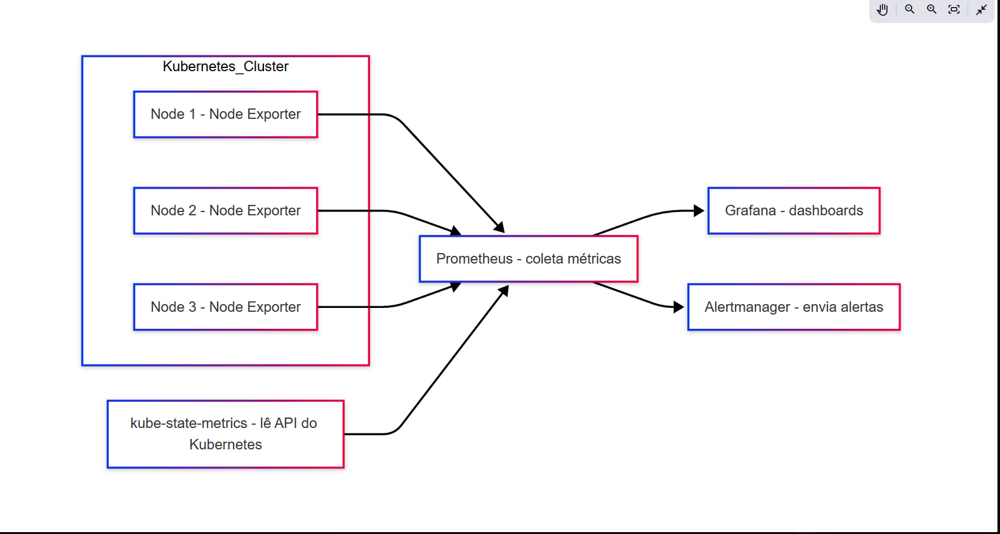
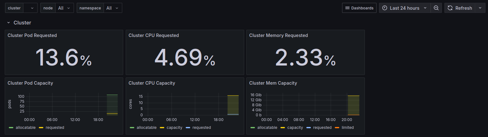

## Mini-NOC com Kubernetes

Este projeto configura uma stack de monitoramento com Prometheus, Grafana e Alertmanager em um cluster Kubernetes local (Minikube). A coleta de métricas é feita através do kube-state-metrics e Node Exporter, com visualizações via Grafana.

### Arquitetura do Sistema

O diagrama abaixo representa como o sistema é organizado:



### Tecnologias Utilizadas

- Kubernetes
- Prometheus
- Grafana
- Alertmanager
- kube-state-metrics
- Node Exporter

### Objetivo

Criar uma estrutura funcional de NOC para fins de aprendizado com foco em infraestrutura baseada em Kubernetes.

### Dashboards Grafana

Foram importados dashboards públicos para visualização das métricas:

- **[Node Exporter Full - ID 1860](images/grafana1.png)**: Mostra detalhes como uso de CPU, memória, disco, I/O de rede, etc.
  
 : Infos de pods


### Status dos Pods

Todos os componentes da stack estão funcionando corretamente após a instalação via Helm:

```bash
kubectl get pods -n monitoring
